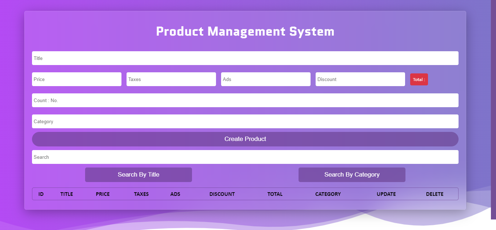
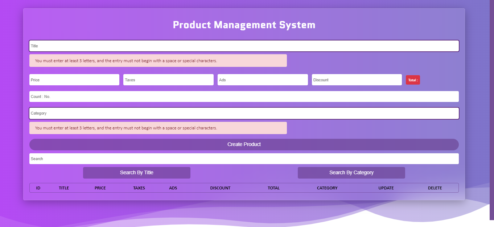
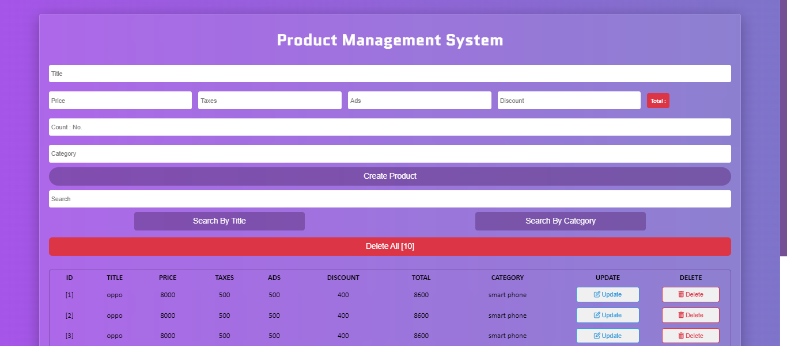

# Product Management System

This is a JavaScript CRUD application for managing products. It uses HTML, CSS, JavaScript, and SweetAlert 2.

## Features

- Add , update , delete , and search in products
- Search functionality
- Regular expressions 
- User-friendly interface
- Real-time updates with SweetAlert 2 notifications

## Technologies Used

- HTML
- CSS
- JavaScript
- SweetAlert 2

## Preview

